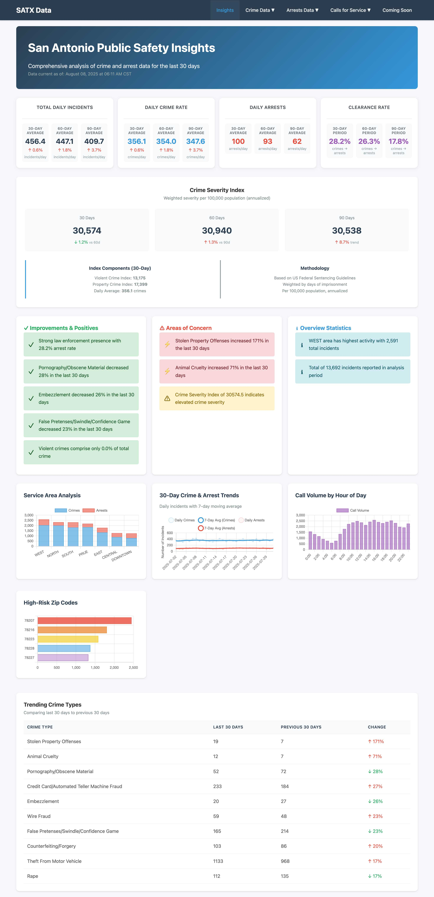
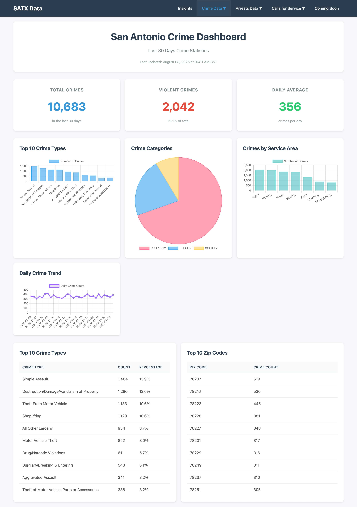
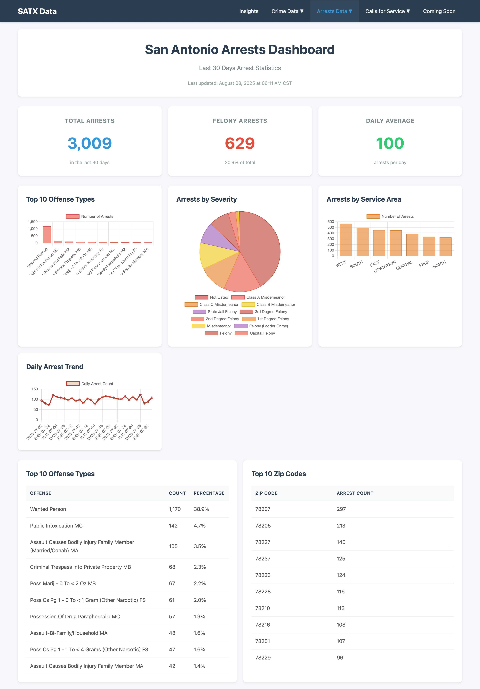
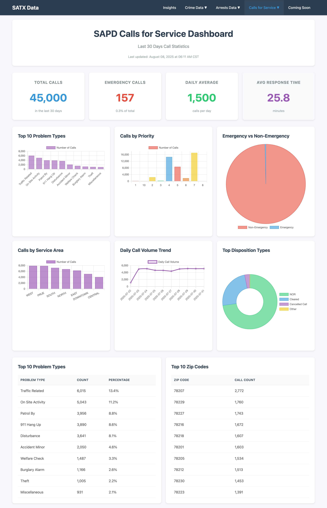

# San Antonio Crime Dashboard

A real-time crime analysis dashboard for San Antonio that visualizes crime trends, arrest patterns, and emergency call data. The application fetches data from San Antonio's Open Data Portal and presents it through an intuitive web interface with comprehensive statistical analysis.

## Screenshots

### Public Safety Insights Dashboard

*Comprehensive overview combining crime, arrest, and call data with trend analysis*

### Crime Dashboard

*Detailed crime statistics with categorization and geographic distribution*

### Arrests Dashboard

*Arrest patterns, severity classifications, and law enforcement metrics*

### Calls for Service Dashboard

*Emergency response analytics with call volume and response time metrics*

## Features

### Multi-View Dashboard System
- **Unified Insights Dashboard**: Combines crime, arrest, and calls data with sophisticated analytics
- **Crime Dashboard**: Detailed crime statistics with categorization and trend analysis
- **Arrests Dashboard**: Arrest patterns and effectiveness metrics
- **Calls for Service Dashboard**: Emergency response analytics and dispatch patterns
- **Interactive Data Lists**: Filterable, searchable tables for each data type

### Key Analytics

#### Crime Severity Index (CSI)
The dashboard calculates a weighted Crime Severity Index based on Federal Sentencing Guidelines. This provides a more accurate picture of public safety than simple crime counts.

**How it works:**
- Each crime type is assigned a weight based on US Federal Sentencing Guidelines (measured in days of imprisonment)
- Weights range from 7 days for minor violations to 10,950 days for capital offenses
- The CSI formula: `(Total Weighted Severity / Population) × 100,000 / Days × 365 / 100`
- This produces a normalized index where higher values indicate more severe crime impact

**Crime Weight Examples:**
- Murder: 10,950 days (Level 43 - Life sentence)
- Aggravated Robbery: 3,285 days (Level 27)
- Burglary of Habitation: 1,095 days (Level 20)
- Simple Assault: 180 days (Level 12)
- Theft: 180 days (Level 12)
- Public Intoxication: 7 days (Level 4)

#### Area Risk Scoring
Each area receives a composite score based on:
- Crime incidents (weighted 3x)
- Arrests (weighted 2x)
- Calls for service (weighted 1x)

This weighted approach recognizes that actual crimes are more concerning than calls that may not result in incidents.

#### Trend Analysis
The system performs sophisticated trend calculations:
- **30-day trends**: Compares current 30 days to previous 30 days
- **Rate-based comparisons**: Normalizes data by days to ensure fair comparisons
- **Moving averages**: Identifies whether crime is genuinely increasing or just normal variation

## Installation

### Prerequisites
- Python 3.8 or higher
- SQLite3 (included with Python)

### Setup

1. Clone the repository:
```bash
git clone https://github.com/yourusername/sa_crime_dashboard.git
cd sa_crime_dashboard
```

2. Create a virtual environment:
```bash
python3 -m venv venv
source venv/bin/activate  # On Windows: venv\Scripts\activate
```

3. Install dependencies:
```bash
pip install -r requirements.txt
```

## Running the Application

### Quick Start
The easiest way to run the application:
```bash
./run.sh
```

This will start the Flask server on http://localhost:5001

### Initial Data Load
On first run, fetch the initial dataset:
```bash
./run.sh --refresh
```

This pulls the latest 90 days of data from San Antonio's Open Data Portal. The process takes about 2-3 minutes depending on your connection.

### Manual Python Execution
```bash
python app.py          # Start the server
python app.py --refresh  # Start with data refresh
```

## Data Sources

The dashboard pulls from three official San Antonio datasets available at the [San Antonio Open Data Portal](https://data.sanantonio.gov/):

1. **Crime Reports** - Detailed incident reports with offense types and locations
2. **Arrest Records** - Booking data with charges and severity classifications  
3. **Calls for Service** - 911 and non-emergency dispatch records

Data is automatically refreshed daily at 3:00 AM CST. Manual refresh is available through the `--refresh` flag.

## Understanding the Metrics

### Safety Score (0-100)
A logarithmic transformation of the Crime Severity Index for intuitive understanding:
- 0-25: Low crime impact
- 26-50: Moderate crime impact
- 51-75: Elevated crime impact
- 76-100: High crime impact

The logarithmic scale prevents outliers from skewing the visualization while maintaining statistical validity.

### Arrest Rate
Calculated as `(Total Arrests / Total Crimes) × 100`

This measures law enforcement effectiveness. Typical rates:
- Below 10%: May indicate enforcement challenges
- 10-20%: Average for major cities
- Above 20%: Strong enforcement presence

### Daily Crime Rate
Simple average of crimes per day over the analysis period. San Antonio typically sees 300-400 crimes per day, which is average for a city of 1.5 million residents.

### Trending Crimes
Uses percentage change between 30-day periods:
```
Change % = ((Recent Count - Previous Count) / Previous Count) × 100
```

Only crimes with 10+ incidents are included to avoid statistical noise from rare events.

## API Access

### Security Features

The API is protected with multiple layers of security:
- **API Key Authentication** - Required for all API endpoints
- **Rate Limiting** - 100 requests per minute per key
- **IP Allowlisting** - Restricts access to trusted sources
- **CORS Protection** - Prevents unauthorized browser access

### Getting an API Key

Generate an API key using the command-line tool:
```bash
python generate_api_key.py "Your Application Name"
```

This will output your API key. **Store it securely** - it cannot be retrieved again.

### Using the API

Include your API key in requests using either method:

**HTTP Header (Recommended):**
```bash
curl -H "X-API-Key: your-api-key-here" \
     http://localhost:5001/api/stats?days=30
```

**Query Parameter:**
```bash
curl http://localhost:5001/api/stats?days=30&api_key=your-api-key-here
```

### API Endpoints

#### Crime Statistics
`GET /api/stats`

Get aggregated crime statistics.

**Parameters:**
- `days` - Number of days to analyze (30, 60, or 90)

**Example Response:**
```json
{
  "total_crimes": 12500,
  "violent_crimes": 2100,
  "crimes_by_type": [
    {"type": "Theft", "count": 3200},
    {"type": "Assault", "count": 1800}
  ],
  "daily_trend": [
    {"date": "2024-01-01", "count": 420}
  ]
}
```

#### Crime Records
`GET /api/crimes`

Get detailed crime records with pagination and filtering.

**Parameters:**
- `page` - Page number (default: 1)
- `per_page` - Records per page (default: 100)
- `crime_type` - Filter by crime type
- `service_area` - Filter by service area
- `zip_code` - Filter by ZIP code
- `date_from` - Start date (YYYY-MM-DD)
- `date_to` - End date (YYYY-MM-DD)
- `search` - Search in crime descriptions

**Example Response:**
```json
{
  "crimes": [
    {
      "report_id": "2024-12345",
      "report_date": "2024-01-15T14:30:00",
      "crime_type": "Theft",
      "crime_against": "Property",
      "service_area": "North",
      "zip_code": "78201",
      "nibrs_group": "Group A"
    }
  ],
  "total": 12500,
  "page": 1,
  "per_page": 100,
  "total_pages": 125
}
```

#### Arrest Records
`GET /api/arrests`

Get arrest records with pagination and filtering.

**Parameters:**
- `page` - Page number (default: 1)
- `per_page` - Records per page (default: 100)
- `offense` - Filter by offense type
- `severity` - Filter by severity (Felony/Misdemeanor)
- `service_area` - Filter by service area
- `zip_code` - Filter by ZIP code
- `date_from` - Start date (YYYY-MM-DD)
- `date_to` - End date (YYYY-MM-DD)
- `search` - Search in offense descriptions

**Example Response:**
```json
{
  "arrests": [
    {
      "report_id": "A2024-12345",
      "report_date": "2024-01-15T10:00:00",
      "person_id": "P123456",
      "offense": "Assault",
      "severity": "Felony",
      "service_area": "Central",
      "zip_code": "78205"
    }
  ],
  "total": 3500,
  "page": 1,
  "per_page": 100,
  "total_pages": 35
}
```

#### Calls for Service
`GET /api/calls`

Get emergency call records with pagination and filtering.

**Parameters:**
- `page` - Page number (default: 1)
- `per_page` - Records per page (default: 100)
- `problem` - Filter by problem type
- `priority` - Filter by priority level
- `call_type` - Filter by call type
- `service_area` - Filter by service area
- `postal_code` - Filter by postal code
- `date_from` - Start date (YYYY-MM-DD)
- `date_to` - End date (YYYY-MM-DD)
- `search` - Search in problem descriptions

**Example Response:**
```json
{
  "calls": [
    {
      "incident_number": "2024-000123",
      "response_date": "2024-01-15T08:30:00",
      "priority": "1",
      "problem": "DISTURBANCE",
      "call_type": "Emergency",
      "service_area": "East",
      "postal_code": "78202",
      "response_seconds": 240
    }
  ],
  "total": 45000,
  "page": 1,
  "per_page": 100,
  "total_pages": 450
}
```

#### Health Check
`GET /api/health`

Check API availability (no authentication required, rate limited to 10 req/min).

**Example Response:**
```json
{
  "status": "healthy",
  "timestamp": "2024-01-15T10:30:00-06:00"
}
```

### Client Examples

**Python:**
```python
import requests

API_KEY = "your-api-key-here"
BASE_URL = "http://localhost:5001"

# Get crime statistics
response = requests.get(
    f"{BASE_URL}/api/stats",
    headers={"X-API-Key": API_KEY},
    params={"days": 30}
)
data = response.json()
print(f"Total crimes: {data['total_crimes']}")
```

**JavaScript:**
```javascript
const API_KEY = 'your-api-key-here';
const BASE_URL = 'http://localhost:5001';

// Get crime statistics
fetch(`${BASE_URL}/api/stats?days=30`, {
    headers: {'X-API-Key': API_KEY}
})
.then(response => response.json())
.then(data => console.log(`Total crimes: ${data.total_crimes}`));
```

**curl:**
```bash
# Get recent arrests with filtering
curl -H "X-API-Key: your-api-key-here" \
     "http://localhost:5001/api/arrests?severity=Felony&page=1"
```

### Rate Limits and Error Codes

**Rate Limits:**
- API endpoints: 100 requests per minute
- Health check: 10 requests per minute

**Error Responses:**
- `401 Unauthorized` - Invalid or missing API key
- `403 Forbidden` - IP address not allowed
- `429 Too Many Requests` - Rate limit exceeded
- `500 Internal Server Error` - Server error

### Security Configuration

For production deployment, configure additional security:

1. Set environment variables in `.env`:
```bash
ALLOWED_IPS=192.168.1.0/24,10.0.0.0/8
FLASK_ENV=production
SECRET_KEY=your-secret-key-here
```

2. Use HTTPS with a reverse proxy (nginx/Apache)
3. Implement request logging and monitoring
4. Regularly rotate API keys

For detailed security documentation, see `API_SECURITY.md`.

## Database Schema

The application uses SQLite with three main tables:

**crimes**
- report_id (PRIMARY KEY)
- report_date
- crime_type
- crime_against (Person/Property/Society)
- service_area
- zip_code
- nibrs_group

**arrests**
- report_id (PRIMARY KEY)
- report_date
- person_id
- offense
- severity
- service_area
- zip_code

**calls_for_service**
- incident_number (PRIMARY KEY)
- response_date
- priority
- problem
- call_type
- service_area
- postal_code
- response_seconds

## Scheduled Updates

The application includes an automatic scheduler that refreshes data daily at 3:00 AM CST. This ensures the dashboard always shows recent information without manual intervention.

The scheduler runs in a background thread and includes:
- Automatic retry on failure
- Rate limiting to respect API limits
- Transaction-based updates to prevent partial data states

## Performance Considerations

The dashboard is optimized for datasets of 100,000+ records:
- Indexed database columns for fast queries
- Pagination on all list views
- Aggregated statistics cached at the database level
- Client-side chart rendering to reduce server load

Typical page load times are under 500ms even with 90 days of data.

## Browser Compatibility

Works best with modern browsers:
- Chrome 90+
- Firefox 88+
- Safari 14+
- Edge 90+

The interface is responsive and works on tablets and larger mobile devices.

## Contributing

Contributions are welcome. Key areas for enhancement:
- Additional crime categorization logic
- Predictive analytics using historical patterns
- Integration with weather data for correlation analysis
- Mobile-optimized views

## License

This project uses public data and is provided as-is for educational and civic purposes. The crime severity weighting system is based on publicly available Federal Sentencing Guidelines.

## Troubleshooting

**Empty Database on First Run**
Run `./run.sh --refresh` to populate the initial dataset.

**Port 5001 Already in Use**
Change the port in app.py: `app.run(debug=True, port=5002)`

**SSL Certificate Errors**
Some networks block the Open Data Portal. Try using a different network or VPN.

**Slow Data Fetching**
The API has rate limits. The initial fetch of 90 days can take several minutes. Subsequent daily updates are much faster.

## Contact

For questions about the dashboard implementation, please open an issue on GitHub.

For questions about the data itself, contact the San Antonio Open Data Portal.